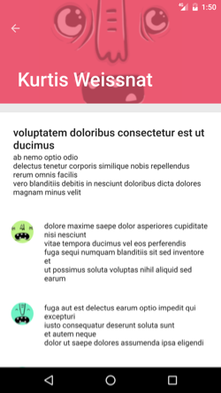
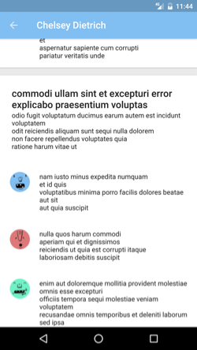

# Adorables

This is a showcase app demonstrating a few of the current best practices for Android development.

  

### Experimentation

Instead of using a ViewPager with Fragments I decided to use the new PagerSnapHelper in conjunction with a RecyclerView. This allows avoiding the horrid Fragment APIs. RecyclerView comes with efficient view recycling, built in animation and better APIs to add/remove/move cells, or in this case 'Pages'.

### Stuff used to make this:

 * [Dagger 2](https://github.com/google/dagger) for dependency injectio
 n
 * [RxJava](https://github.com/ReactiveX/RxJava) Reactive Extensions for the JVM
 * [AutoValue](https://github.com/google/auto/tree/master/value) preprocessor to create immutable classes - used in conjunction with [AutoParcel](https://github.com/rharter/auto-value-parcel) to create Parcelable class implementation
 * [AdapterDelegates](https://github.com/sockeqwe/AdapterDelegates) "favour composition over inheritance" for RecyclerView Adapters
 * [ButterKnife](https://github.com/JakeWharton/butterknife) annotation processing to generate boilerplate code
 * [RxBinding](https://github.com/JakeWharton/RxBinding) reactive binding APIs for Android UI widgets
 * [Retrofit 2](https://github.com/square/retrofit) type-safe HTTP client
 * [Picasso](https://github.com/square/picasso) image downloading and caching library
 * [Android Support Libraries](https://developer.android.com/topic/libraries/support-library/index.html) just awesome ¯\_(ツ)_/¯
